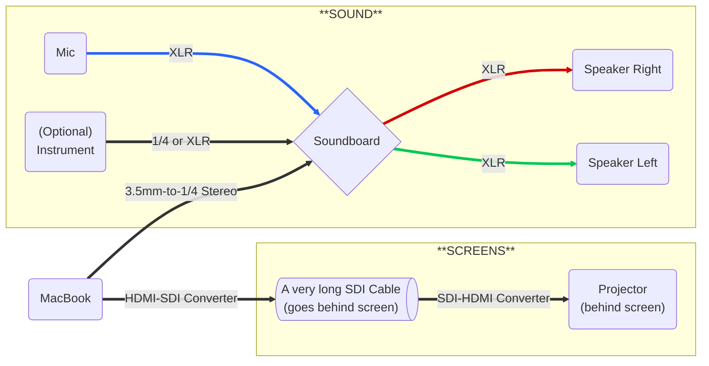
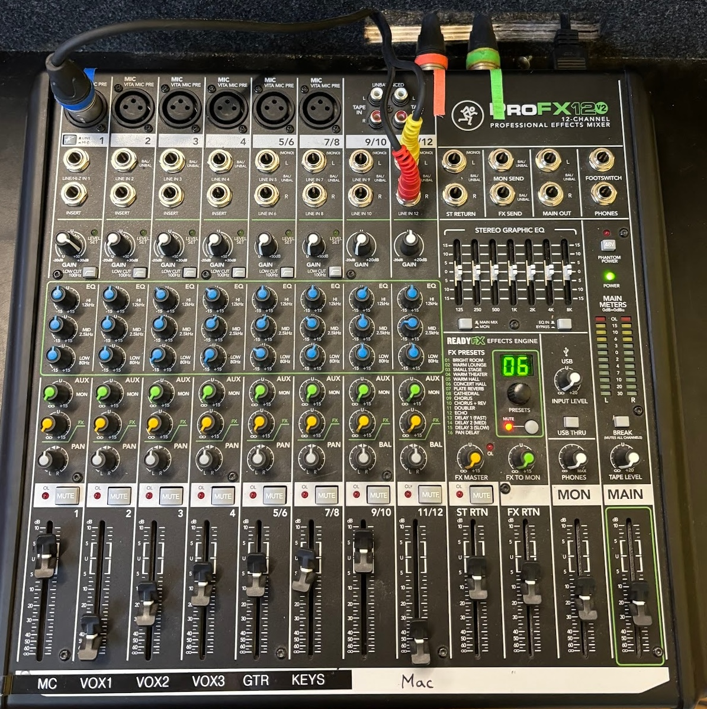

# Kids Production Setup/Teardown

## **Checklists**
You can use these checklist (try clicking on the checkboxes!) to keep track of what you've done. Refreshing the browser will reset the checklist.

???+ success "Turning ON"
    ### Turning ON
    - [ ] Turn the projector ON
    - [ ] Turn the soundboard ON
    - [ ] Turn both speakers ON
    - [ ] Log into the MacBook (ask the service lead for the password)
        - [ ] Test BOTH sound + video from ProPresenter
        - [ ] Play music from Spotify
    - [ ] Test the microphone

???+ success "Turning OFF"
    ### Turning OFF
    - [ ] Turn the projector OFF
    - [ ] Turn the speakers OFF (before the soundboard!!!)
    - [ ] Turn the soundboard OFF
    - [ ] Lock the MacBook (Ctrl + Cmd + Q)

## **Setup/Teardown**
We're going to breakdown the production setup in the midtown gym into two aspects:

1.  Sound
2.  Screens

For each aspect of the production setup, there are three main steps to think about:

1.  Input/Source (image/video or sound)
2.  Control (soundboard)
3.  Output (projector or speakers)

### Input/Source
This includes anything that produces sound or visuals. 
On a typical sunday, this includes:

*   Sound coming from a Shure SM58 microphone (*via XLR*)
*   Sound coming out of the MacBook (*via 3.5mm-to-1/4" stereo*)
*   Video coming from ProPresenter (*via HDMI/SDI*)

??? custom "How to connect other types of audio input"
    * **Acoustic guitar**
        * **Recommended**: 1/4" + DI-box + XLR → into any channel 1-8 via XLR
        * 1/4" → into any channel 1-12 via 1/4"
    * **Keys**
        * **Recommended**: 1/4" + DI-box + XLR → into two XLR channels + pan hard L/R
        * 1/4" → into stereo channels (5/6, 7/8, 9/10)

### Control

* The **soundboard** is the only point of control in the Kids production setup. 
* The video is controlled either in ProPresenter or the projector input selection, which shouldn't change week-to-week.

??? custom "How to use the soundboard"
    ### A typical C3 Kids Sunday uses these channels:

    *   **[Channel 1]** Microphone (blue XLR)
    *   **[Channel 11/12]** MacBook L/R
    *   **[MAIN Fader]** Fader controlling overall volume
    ??? info "How to configure channels"
        --8<-- "snippets/kids-soundboard-tabs.md"

    
    

### Output

*   The **speakers** should be the only source of audio output. 
    *   We shouldn't hear sound coming out of the MacBook or the projector/TV
*   The **projector** is the only source of image/video output.

??? custom "How to add additional outputs for monitoring / recording"
    * **Monitor wedge**: connect 1/4" via 'MON SEND' on the top-right part of the face of the board
    * **Recorder (Ex: TASCAM, ZOOM)**
        * 1/4" stereo → 'MAIN OUT'  
        * RCA stereo → 'TAPE OUT'

